### by Letomaniy
## [In english](#en)
## [На русском](#ru)

# RU    
## DeftHack Unturned информация

:white_check_mark: Бывший приватный чит на Unturned на базе чита Thanking. С наличием обхода чит будет работать. Так же можно скомпилировать для игры на серверах без BattlEye. В случае недостачи файлов, задавайте вопрос. 

## Как использовать?
1. Компилируем чит с помощью Visual Studio и получаем файл (UnityEngine.FileSystemModule.dll)
1.1 Скачиваем dnSpy (https://github.com/0xd4d/dnSpy/releases/tag/v6.1.7)
2. Открываем скачанный dnSpy

 

2.1 Добавляем файл скомпилированного чита (UnityEngine.FileSystemModule.dll) , а так же файл (System.Core.dll) из папки (Unturned/Unturned_Data/Managed)

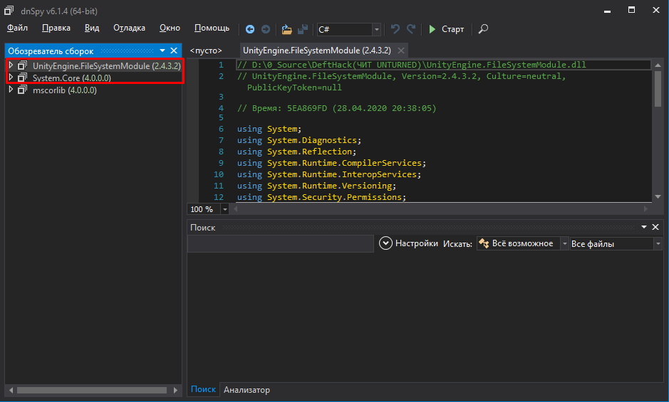 

2.2 Переходим в System.Core.dll далее далее далее и выбираем <Module> жмём правой кнопкой мыши->Создать метод
  
  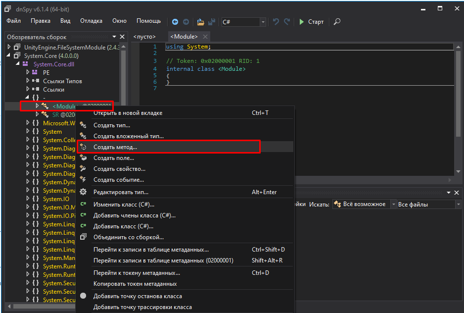 
  
  2.3 Ставим параметры как на фото ниже и жмём OK
  
  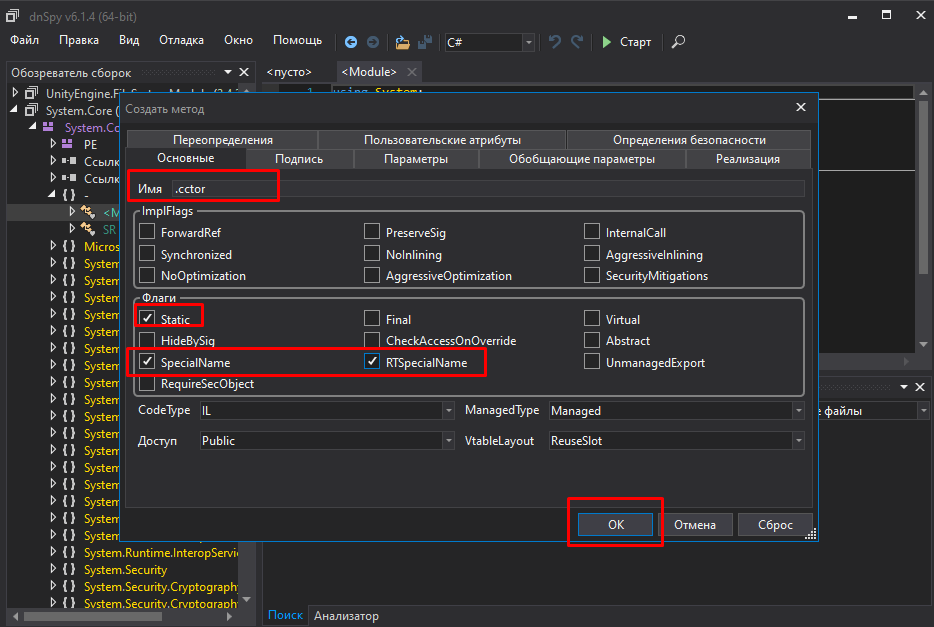 
  
  2.4 Правой кнопкой мыши на .cctor и "Изменить тело метода"
  
  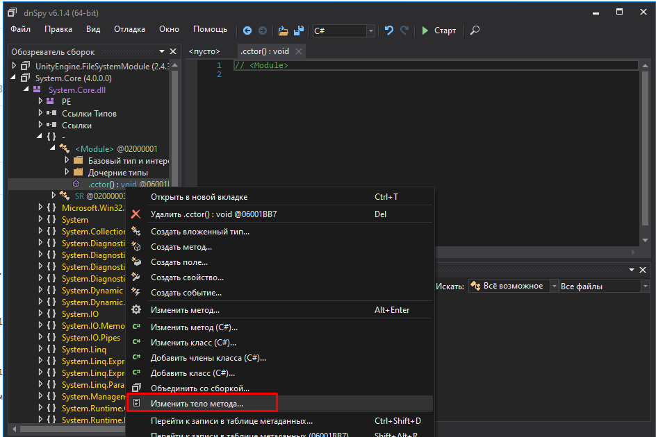 
  
  2.5 Выбираем Тип содержимого IL
  
  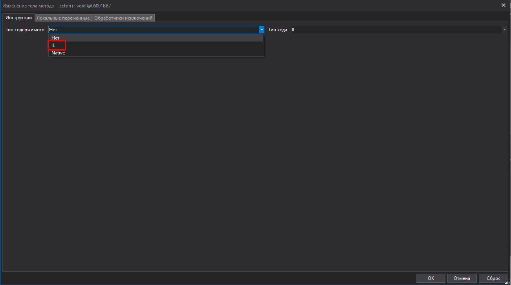 
  
  2.6 Создадим две новые инструкции
  
  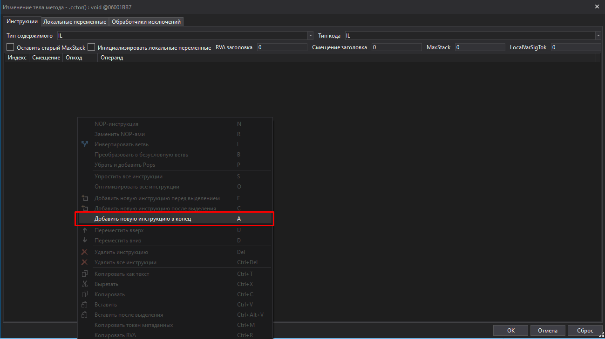 
  
  2.7 Редактируем опкод первой инструкции на call, а второй на ret как указано на второй картинке
  
  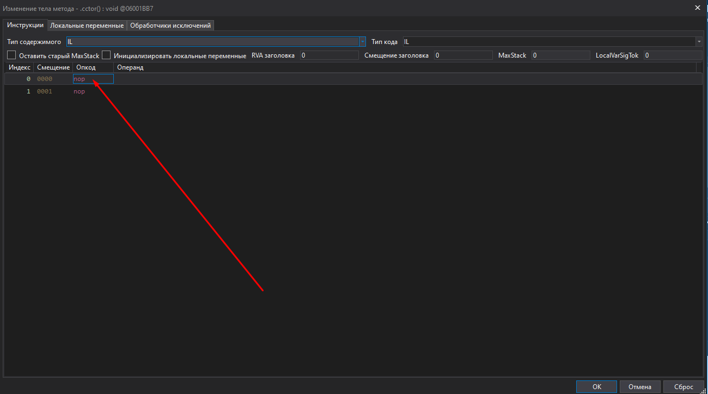 
  
  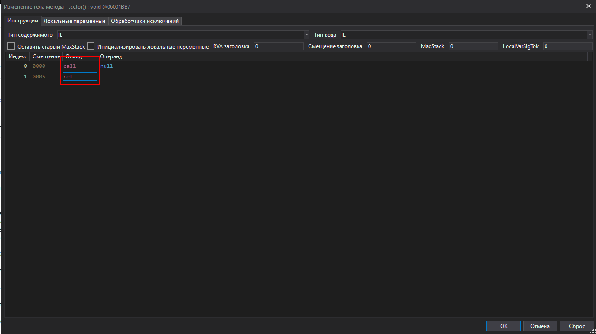 
  
  2.8 Далее у первой инструкции вместо null выбираем Метод DynamicObject. должно получится как на второй картинке, после чего жмём OK
  
  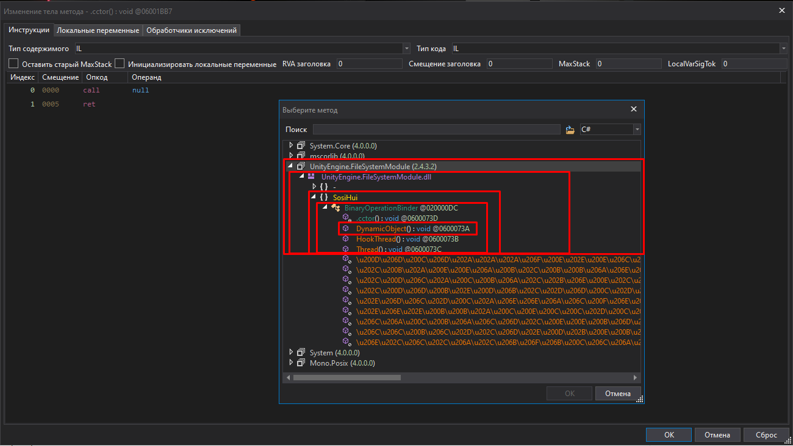 
  
  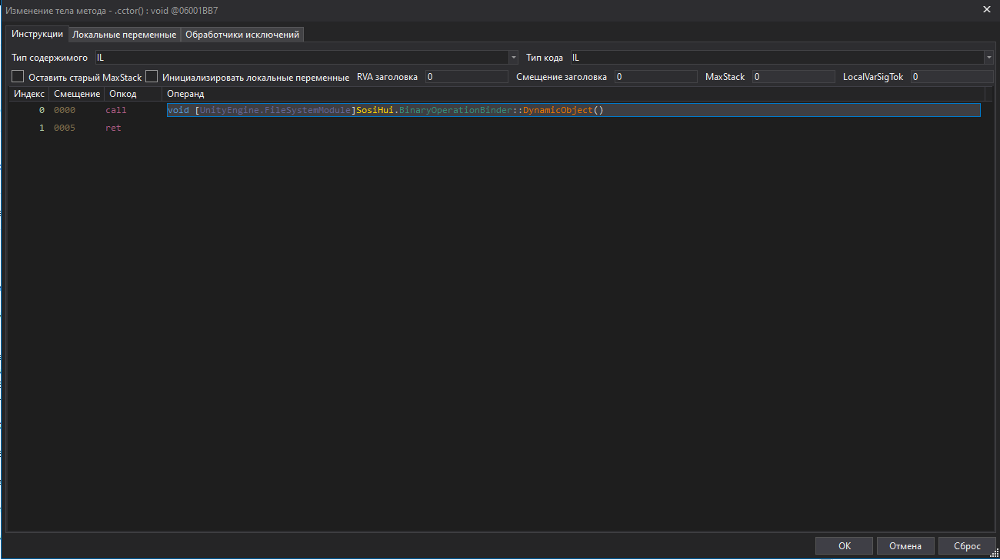 
  
  2.9 Далее жмём на Файл->Сохранить модуль (изображение ниже) и жмём ОК (изображение 2)
  
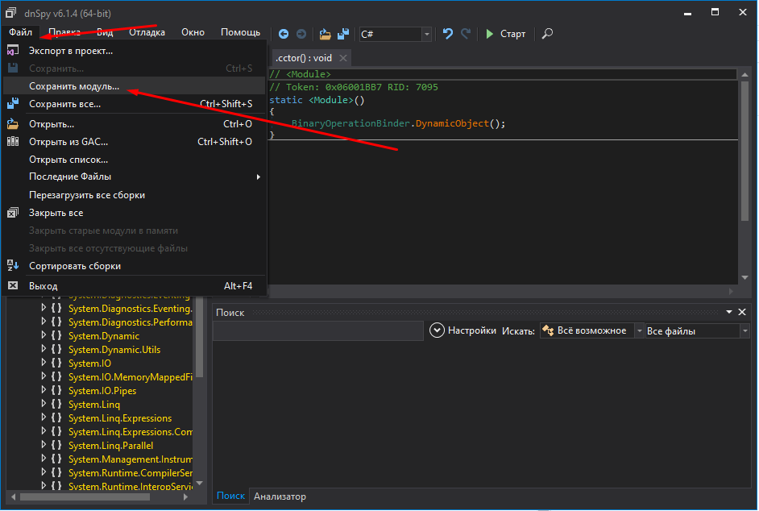 

  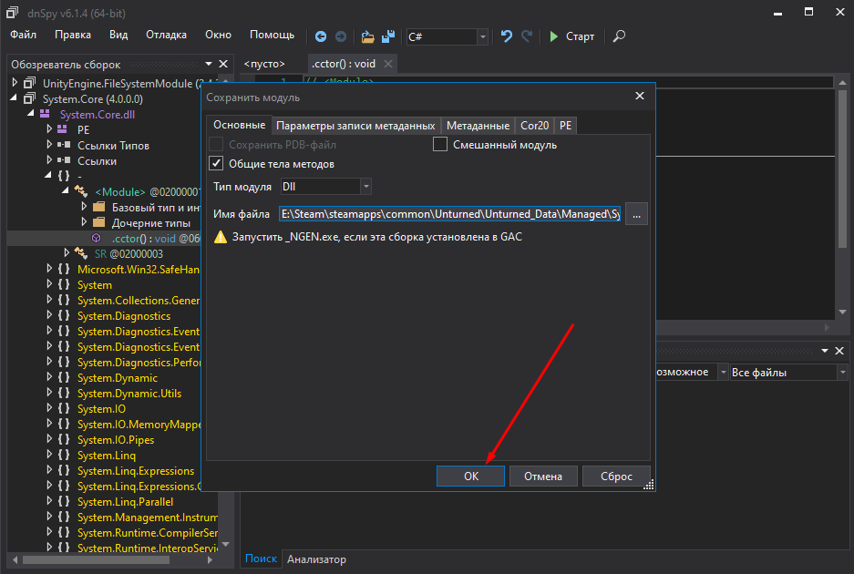 
  
3. Теперь переносим файл (UnityEngine.FileSystemModule.dll) в папку (Unturned/Unturned_Data/Managed), а так же файл assets в папку (Unturned/Unturned_Data). Запускаем игру и пробуем позже прожать F1 
# Внимание!!! Такой метод подходит только для Non-BE и Non-VAC серверов!

# EN
## DeftHack Unturned info

:white_check_mark: Former private reader on Unturned based on the cheat Thanking. The cheat will work with a bypass. It can also be compiled to play on servers without BattlEye. In case of missing files, ask a question.

## How to use?
1. We compile the cheat using Visual Studio and get the file (UnityEngine.FileSystemModule.dll)
1.1 Downloading dnSpy (https://github.com/0xd4d/dnSpy/releases/tag/v6.1.7)
2. Open the downloaded dnSpy

 

2.1 Add the compiled cheat file (UnityEngine.FileSystemModule.dll), as well as the file (System.Core.dll) from the (Unturned / Unturned_Data / Managed) folder

 

2.2 Go to System.Core.dll further further further and select <Module> right-click-> Create method
  
   
  
  2.3 Set the parameters as in the photo below and click OK
  
   
  
  2.4 Right click on .cctor and "Modify Method Body"
  
   
  
  2.5 Selecting the IL Content Type
  
   
  
  2.6 Let's create two new instructions
  
   
  
  2.7 We edit the opcode of the first instruction to call, and the second to ret as shown in the second picture
  
   
  
   
  
  2.8 Next, instead of null, select the DynamicObject Method for the first instruction. it should look like the second picture, then click OK
  
   
  
   
  
  2.9 Next, click on File-> Save Module (image below) and click OK (image 2)
  
 

   
  
3. Now we transfer the file (UnityEngine.FileSystemModule.dll) to the folder (Unturned / Unturned_Data / Managed), as well as the assets file to the folder (Unturned / Unturned_Data). We start the game and try to squeeze F1 later
# Attention!!! This method is only suitable for Non-BE and Non-VAC servers!
